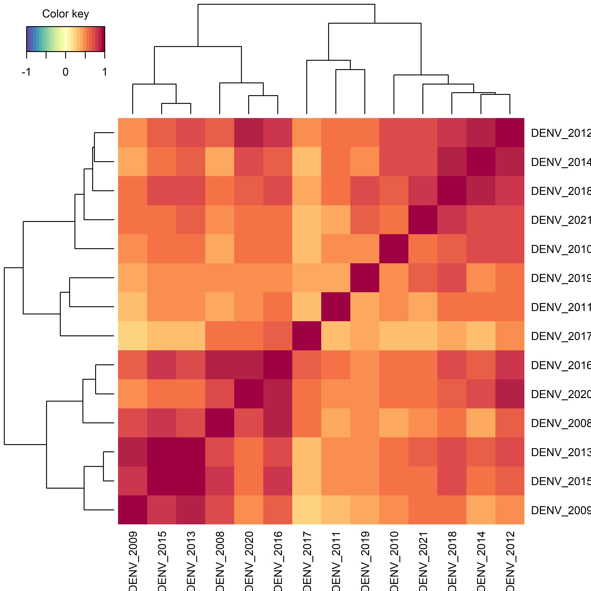

```{r xaringan-fit-screen, echo=FALSE}
xaringanExtra::use_fit_screen()
```

```{r xaringanExtra, echo = FALSE}
xaringanExtra::use_progress_bar(color = "#0051BA", location = "top")
```

```{r xaringan-tachyons, echo=FALSE}
xaringanExtra::use_tachyons()
```

```{r share-again, echo=FALSE}
xaringanExtra::use_share_again()
```
## Objetivo General
&nbsp;
### Desarollar un modelo de Estratificación del Dengue 
&nbsp;
&nbsp;
## Objetivo Específico 

&nbsp;
### Identificar las localidades de mayor riesgo usando estadística multivariada
&nbsp;

### Comparar el analysis de cluster y la metodología de Dalenius-Hodge en la identificación de las localidades de alto riesgo.

&nbsp;
### Identificar los factores que se relacionan con las localidades de mayor riesgo usando estadística multivariada


---
class: center, middle
## Modelo de Estratificación del Dengue en México
.pull-left[

```{r, echo=FALSE}
DiagrammeR::grViz("digraph {
                  # graph definitions
  graph [layout = dot, rankdir = TB]
  
  # node definitions
  node [shape = rectangle, style = filled, color = grey] 
   
  ##### dengue
  dataset [label = 'Base de Datos',  fillcolor =  '#DB4437', color = 'white', fontcolor = 'white']
  
  sinave [label = 'Sinave',  fillcolor =  'DodgerBlue', color = 'white', fontcolor = 'white']

  worldclim [label = 'WorldClim',  fillcolor =  ' #0F9D58', color = 'white', fontcolor = 'white']
 
   iter [label = 'INEGI 2020',  fillcolor =  'orange', color = 'white', fontcolor = 'black']
 
 
 
  
  #### Analysis
  
  pca [label = 'PCA',  fillcolor =  '#8BC3FC', color = 'white', fontcolor = 'black']
  
  clust [label = 'Cluster Analysis',  fillcolor =  '#8BC3FC', color = 'white', fontcolor = 'black']
  
  indice [label = 'Indice',  fillcolor =  '#F4B400', color = 'white', fontcolor = 'black']
  
    dalenius [label = 'Dalenius & Hodge',  fillcolor =  '#8BC3FC', color = 'white', fontcolor = 'black']
    
    loc1 [label = 'Localidades de Riesgo 1',  fillcolor =  '#3C327B', color = 'white', fontcolor = 'white']
    
    loc2 [label = 'Localidades de Riesgo 2',  fillcolor =  '#3C327B', color = 'white', fontcolor = 'white']
  
{sinave worldclim iter} -> pca -> dataset -> indice -> {clust, dalenius} 

clust -> loc1
dalenius -> loc2

sens [label = 'Análisis de Sensibilidad & Especificidad',  fillcolor =  '#8BC3FC', color = 'white', fontcolor = 'black']
{loc1 loc2} -> sens
  
}")
```

]
.pull-right[
```{r, echo=FALSE}
DiagrammeR::grViz("digraph {
                  # graph definitions
  graph [layout = dot, rankdir = TB]
  
  # node definitions
  node [shape = rectangle, style = filled, color = grey] 
   
  ##### dengue
  dataset [label = 'Base de Datos',  fillcolor =  '#DB4437', color = 'white', fontcolor = 'white']
  
  sinave [label = 'Sinave',  fillcolor =  'DodgerBlue', color = 'white', fontcolor = 'white']
  cases_a [label = '2008-2015',  fillcolor =  '#4285F4', color = 'white', fontcolor = 'white']
  cases_b [label = '2016-2021',  fillcolor = '#4285F4', color = 'white', fontcolor = 'white']
  
  sinave -> {cases_a[arrowhead = 'crow', arrowtail = 'box', color = 'white'] cases_b} -> dataset
  
  ##### worldclim
  worldclim [label = 'WorldClim',  fillcolor =  ' #0F9D58', color = 'white', fontcolor = 'white']
  bios [label = 'Bio1-Bio19',  fillcolor =  ' #0F9D58', color = 'white', fontcolor = 'white']
  worldclim -> bios -> dataset
  
  ##### Iter 2020
   iter [label = 'ITER 2020',  fillcolor =  '#F4B400', color = 'white', fontcolor = 'black']
  tema [label = 'Tema',  fillcolor =  '#F4B400', color = 'white', fontcolor = 'black']
  
  #### Analysis
  
  pca [label = 'PCA',  fillcolor =  '#F4B400', color = 'white', fontcolor = 'black']
  
  clust [label = 'Cluster Analysis',  fillcolor =  '#F4B400', color = 'white', fontcolor = 'black']
  
  iter -> tema  -> dataset
  
  
  
  indice [label = 'Indice',  fillcolor =  '#F4B400', color = 'white', fontcolor = 'black']
  
    dalenius [label = 'Dalenius & Hodge',  fillcolor =  '#8BC3FC', color = 'white', fontcolor = 'black']
    
    loc1 [label = 'Localidades de Riesgo 1',  fillcolor =  '#3C327B', color = 'white', fontcolor = 'white']
    
    loc2 [label = 'Localidades de Riesgo 2',  fillcolor =  '#3C327B', color = 'white', fontcolor = 'white']
    
  dataset -> pca -> indice -> {dalenius, clust} 
  
  clust -> loc1
dalenius -> loc2

sens [label = 'Análisis de Sensibilidad & Especificidad',  fillcolor =  '#8BC3FC', color = 'white', fontcolor = 'black']
{loc1 loc2} -> sens

}")
```

]


---
class: center, middle
## Casos vs variables Climáticas & Demográficas


### Análisis Exploratorio de las bases de Datos

```{r, echo=FALSE}
DiagrammeR::grViz("digraph {
                  # graph definitions
  graph [layout = dot, rankdir = TB]
  
  # node definitions
  node [shape = rectangle, style = filled, color = grey] 
   
  ##### datasets
 
  sinave [label = 'Sinave',  fillcolor =  'DodgerBlue', color = 'white', fontcolor = 'white']

  worldclim [label = 'WorldClim',  fillcolor =  ' #0F9D58', color = 'white', fontcolor = 'white']
 
   iter [label = 'INEGI 2020',  fillcolor =  'orange', color = 'white', fontcolor = 'black']
 
 
 
  #### Analysis
  
  corrmat [label = 'Correlation Matrix',  fillcolor =  '#8BC3FC', color = 'white', fontcolor = 'black']
  
  det [label = 'Determinante',  fillcolor =  '#8BC3FC', color = 'white', fontcolor = 'black']
  
  bar [label = 'Bartlett Test',  fillcolor =  '#8BC3FC', color = 'white', fontcolor = 'black']
  
  kmo [label = 'KMO Test',  fillcolor =  '#8BC3FC', color = 'white', fontcolor = 'black']
    
  {sinave worldclim iter} ->  {corrmat det, bar kmo} 
  
}", height = 100)
```


### Análisis de las bases de datos

```{r, echo=FALSE}
DiagrammeR::grViz("digraph {
                  # graph definitions
  graph [layout = dot, rankdir = TB]
  
  # node definitions
  node [shape = rectangle, style = filled, color = grey] 
   
  ##### datasets
 
  sinave [label = 'Sinave',  fillcolor =  'DodgerBlue', color = 'white', fontcolor = 'white']

  worldclim [label = 'WorldClim',  fillcolor =  ' #0F9D58', color = 'white', fontcolor = 'white']
 
   iter [label = 'INEGI 2020',  fillcolor =  'orange', color = 'white', fontcolor = 'black']
 
sinave_inegi [label = 'SINAVE-INEGI',  fillcolor =  '#DB4437', color = 'white', fontcolor = 'white']
sinave_bio [label = 'SINAVE-WorlClim',  fillcolor =  '#DB4437', color = 'white', fontcolor = 'white']

##### analysis
 pls1 [label = 'Projection to Latent Structure',  fillcolor =  '#8BC3FC', color = 'white', fontcolor = 'black']
  pls2 [label = 'Projection to Latent Structure',  fillcolor =  '#8BC3FC', color = 'white', fontcolor = 'black']

##
{sinave iter} -> sinave_inegi
{sinave worldclim} -> sinave_bio

sinave_inegi -> pls1
sinave_bio -> pls2
###
 var_exp_bio[label = 'var exp bio',  fillcolor =  '#3C327B', color = 'white', fontcolor = 'white']
    
var_bio [label = 'var bio imp',  fillcolor =  '#3C327B', color = 'white', fontcolor = 'white']

pls2 ->{var_exp_bio, var_bio}

###
 var_exp_iter[label = 'var exp inegi',  fillcolor =  '#3C327B', color = 'white', fontcolor = 'white']
    
var_iter [label = 'var inegi imp',  fillcolor =  '#3C327B', color = 'white', fontcolor = 'white']

pls1 ->{var_exp_iter, var_iter}

}", height = 300)
```

---
class: center, middle
## Resultado de los análisis exploratorios
.pull-left[.blue[Correlation Matrix: Dengue]

]
.pull-right[
.blue[Correlation Matrix: INEGI]

]

---
## Resultado de los análisis exploratorios


---

# Thanks!

&nbsp;

- ***email***      :     felipe.dzul.m@gmail.com

- ***celular***    :     228 229 3419

- ***slides***     :     https://fdzul.netlify.app/#1


.footnote[La presentación fue creada via [**xaringan**](https://github.com/yihui/xaringan),
[**revealjs**](https://revealjs.com/),
[remark.js](https://remarkjs.com), [**knitr**](http://yihui.name/knitr),
& [R Markdown](https://rmarkdown.rstudio.com) en [R]() & [RStudio](2.R_Scripts/libs/rstudio_leaflet/rstudio_leaflet.css).]


